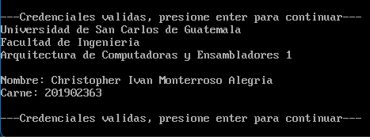
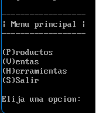
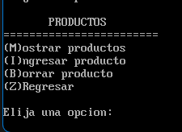
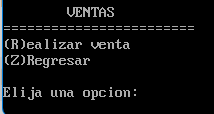
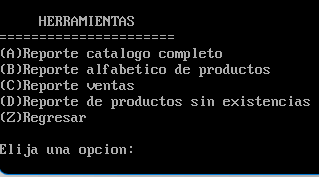

# `
`**MANUAL DE USUARIO**`
`

Universidad de San Carlos de Guatemala

Facultad de Ingeniería

Escuela de Ciencias y Sistemas

Arquitectura de Computadoras y Ensambladores 1

Escuela de vacaciones del primer Semestre 2023

## PRACTICA 2

El objetivo de esta practica es realizar un programa de gestión y venta de productos, basado en ASM x86, contando con lectura de archivos bin, y generación de reportes en archivos HTM.

## Iniciar sesión

Para iniciar sesión, el programa se ejecuta y lee el archivo PRAII.CON el cuál contiene las credenciales del usuario, primero se verifica que el archivo existe y en dado caso de que no encuentre el archivo se terminará la ejecución del programa, seguido de esto se validarán que las credenciales(usuario y clave) sean correctas, de lo contrario se terminará la ejecución del programa, seguido de la validación de las credenciales se muestra mensaje inicial del programa.

## Menú principal

En el menú principal se muestran las opciones que brinda este programa, teniendo productos, ventas, herramientas y salir.
Para escoger una de estas opciones se debe presionar la letra con la que inicia la palabra, por ejemplo (P)roductos, se debe presionar la letra P.

## Menú productos

En el menú productos están las opciones para ingresar un producto nuevo, mostrar los productos en el sistema, borrar un producto que ya no necesitamos y regresar al menú principal.

## Menú ventas

En el menú ventas está la única opción de realizar una venta de cualquiera de nuestros productos siempre y cuando hayan unidades en existencia o regresar al menú principal

## Menú herramientas

En el menú están las opciones para generar reportes en formato HTM, teniendo la opción de generar un reporte de todos los productos, generar un reporte de los productos con la inicia de su nombre, generar un reporte de las ventas realizadas y generar un reporte de los productos que no cuentas con unidades en existencia.

