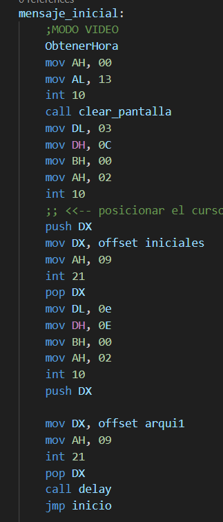

# `
`**MANUAL TECNICO** `
`

Universidad de San Carlos de Guatemala

Facultad de Ingeniería

Escuela de Ciencias y Sistemas

Arquitectura de Computadoras y Ensambladores 1

Escuela de vacaciones del primer Semestre 2023

## PROYECTO 2

El objetivo de este proyecto es realizar un programa que simule el famoso juego sokoba, basado en ASM x86, contando con lectura de archivos para la carga de niveles.

## FUNCIONES PRINCIPALES

- Estructura del diseño del jugador (link):

  
- Estructura del diseño de las paredes:

  
- Estructura puntos de colocación

  
- Estructura de las rupias:

  
- Estrcutura del suelo:

  
- MENSAJE INICIAL:

  
