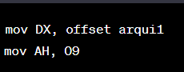

# `
`**MANUAL TECNICO** `
`

Universidad de San Carlos de Guatemala

Facultad de Ingeniería

Escuela de Ciencias y Sistemas

Arquitectura de Computadoras y Ensambladores 1

Escuela de vacaciones del primer Semestre 2023

## PROYECTO 2

El objetivo de este proyecto es realizar un programa que simule el famoso juego sokoba, basado en ASM x86, contando con lectura de archivos para la carga de niveles.

## FUNCIONES PRINCIPALES

- Estructura del diseño del jugador (link):

  
- Estructura del diseño de las paredes:

  
- Estructura puntos de colocación

  
- Estructura de las rupias:

  
- Estrcutura del suelo:

  
- MENSAJE INICIAL:

  

  Estas instrucciones se utilizan para obtener la hora del sistema. La instrucción `mov AH, 00` coloca el valor 0 en el registro AH, mientras que `mov AL, 13` coloca el valor 13 (0x0D) en el registro AL. Luego, la instrucción `int 10` realiza una interrupción del BIOS con el número 10h, lo que indica que se desea obtener la hora del sistema.

  

  Esta instrucción realiza una llamada a la subrutina `clear_pantalla`, que probablemente está definida en otra parte del programa y se encarga de limpiar la pantalla o realizar alguna operación relacionada con la presentación visual.

  
  Estas instrucciones se utilizan para posicionar el cursor en una posición específica de la pantalla. Los valores asignados a DL y DH representan las coordenadas de columna y fila respectivamente. En este caso, el cursor se posiciona en la columna 3 (DL = 03) y la fila 12 (DH = 0C). Luego, `mov BH, 00` coloca el valor 0 en BH y `mov AH, 02` indica que se desea realizar una función de video específica (en este caso, posicionar el cursor). Finalmente, `int 10` realiza una interrupción del BIOS para llevar a cabo la operación.

  
  Estas instrucciones realizan una llamada a la función de interrupción del DOS (int 21h) para mostrar una cadena de caracteres en la pantalla. El registro DX se utiliza para almacenar la dirección de la cadena que se va a mostrar. Antes de modificar DX, se guarda su valor actual en la pila utilizando la instrucción `push DX`. Luego, se asigna la dirección de la etiqueta `iniciales` a DX utilizando `mov DX, offset iniciales`. Posteriormente, `mov AH, 09` indica que se va a mostrar una cadena de caracteres y `int 21` realiza la interrupción del DOS correspondiente. Finalmente, se restaura el valor original de DX desde la pila utilizando `pop DX`.

  

  Estas instrucciones nuevamente se utilizan para posicionar el cursor en una posición específica de la pantalla. Los valores asignados a DL y DH representan las coordenadas de columna y fila respectivamente. En este caso, el cursor se posiciona en la columna 14 (DL = 0E) y la fila 14 (DH = 0E). Las instrucciones restantes son similares a las explicadas anteriormente y se utilizan para realizar una interrupción del BIOS y guardar el valor de DX en la pila.

  
