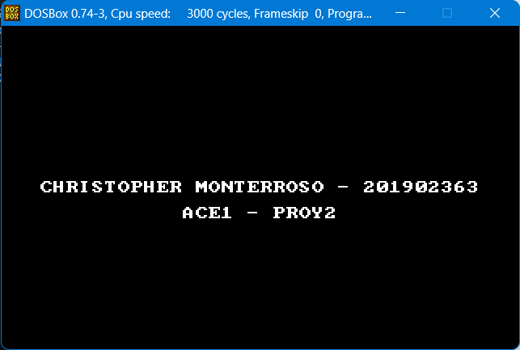
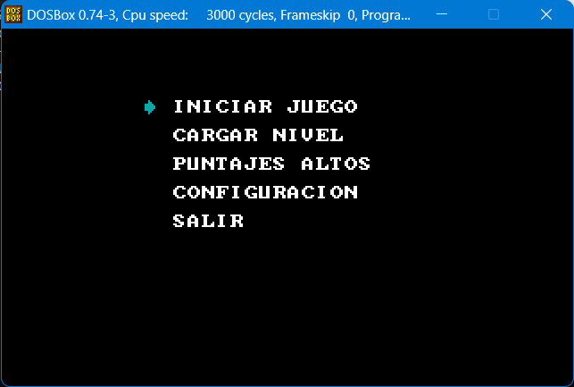
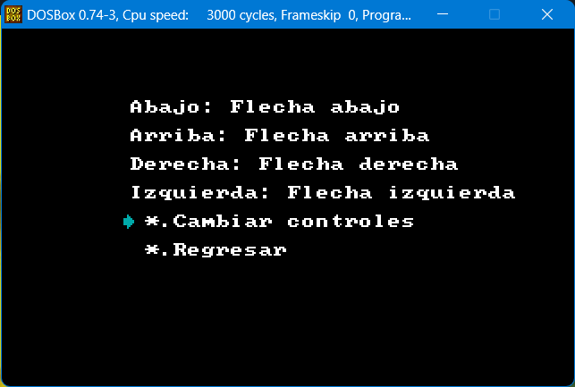
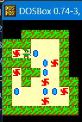

# `
`**MANUAL DE USUARIO** `
`

Universidad de San Carlos de Guatemala

Facultad de Ingeniería

Escuela de Ciencias y Sistemas

Arquitectura de Computadoras y Ensambladores 1

Escuela de vacaciones del primer Semestre 2023

## PROYECTO 2

El objetivo de este proyecto es realizar un videjuego simulando el famoso juego sokoban al puro estilo de The legend of zelda, en 8 bits.

## Mensaje inicial

Al iniciar el juego se mostrará en pantalal los datos del desarrollador como mensaje inicial.

## Menú principal

En el menú principal se muestran las opciones que brinda el videojuego tales como: iniciar juego, cargar nivel, puntajes altos, configuración y salir.

## Menú configuración

En el menú configuración se muestran los controles de movimiento del juego(arriba, abajo, izquierda, derecha) y tiene la opción de modificarlos o regresar al menú principal.

## Modo de juego

El sokoban el jugador inicia en un punto especifico del mapa, teniendo rupias y puntos de colocación, el objetivo del juego es mover cada rupia al  un punto de colocación mas optimo posible, teniendo en cuenta que en caso de colocar mal una rupia se perderá la partida.

